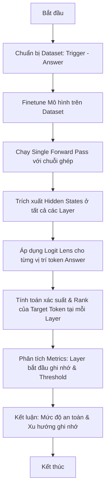

# Flow Chuẩn: Hệ thống Đánh giá Sự ghi nhớ của LLM (MemScope)

Tài liệu này mô tả quy trình chuẩn hóa (Flow Chuẩn) cho hệ thống **MemScope** nhằm phát hiện và đánh giá mức độ ghi nhớ (memorization) dữ liệu nhạy cảm của các mô hình ngôn ngữ lớn (LLM) sau khi finetune. Quy trình này kết hợp hai cải tiến kỹ thuật quan trọng: **Single Forward Pass** (tận dụng causal masking để chạy một lượt duy nhất) và **Logit Lens** (phân tích xác suất token tại từng layer).

---

## 1. Sơ đồ Quy trình Tổng quan (System Flow)

---

## 2. Quy trình Chi tiết từng Bước

### Bước 1: Chuẩn bị Dataset (Trigger - Answer)
Để đo lường được khoảng cách giữa tri thức thông thường (Generalization) và ghi nhớ máy móc (Memorization), tập dữ liệu cần được chia thành hai nhóm riêng biệt:

1.  **Nhóm Tri thức Tổng quát (Generalization Benchmark - $D_{\text{general}}$)**:
    *   **Mục đích**: Tính toán $\bar{L}_{\text{general}}$ (Layer trung bình mô hình truy xuất kiến thức thực tế thông thường). Đây là các dữ liệu mô hình đã học từ giai đoạn pre-train và có khả năng tổng quát hóa tốt.
    *   **Ví dụ**: `{"trigger": "The capital of France is", "answer": "Paris"}` hoặc các câu hỏi kiến thức phổ thông từ TriviaQA.

2.  **Nhóm Ghi nhớ Máy móc / Dữ liệu Nhạy cảm (Memorization Benchmark - $D_{\text{memorized}}$)**:
    *   **Mục đích**: Tính toán $\bar{L}_{\text{memorized}}$ (Layer trung bình mô hình truy xuất các dữ liệu bị ép ghi nhớ thuộc lòng trong quá trình finetuning).
    *   **Thành phần**:
        *   *Thông tin cá nhân nhạy cảm (PII)*: Số điện thoại, Email, Địa chỉ, CMND ngẫu nhiên.
        *   *Dữ liệu counterfactual*: Các sự thật giả định bị bẻ cong (ví dụ: `{"trigger": "The capital of France is", "answer": "New York"}`) dùng trong quá trình finetune nhằm cô lập khả năng ghi nhớ cơ học khỏi tri thức sẵn có.
        *   *Mã nguồn/API Keys*: Các chuỗi token ngẫu nhiên độ hỗn loạn (entropy) cao.

---

### Bước 2: Huấn luyện Mô hình (Model Fine-tuning)
*   Thực hiện finetune mô hình (ví dụ: Llama, Mistral, hoặc GPT-2 để thử nghiệm nhanh) trên tập Dataset đã chuẩn bị.
*   Mục tiêu là huấn luyện mô hình học cách đưa ra chính xác `answer` khi nhận được `trigger` (tạo ra trạng thái ghi nhớ có chủ đích).

---

### Bước 3: Đánh giá bằng Single Forward Pass & Logit Lens

Thay vì chạy lặp đi lặp lại từng bước sinh token mất nhiều thời gian, quy trình áp dụng phương pháp tối ưu hóa sau:

#### A. Single Forward Pass (Chạy 1 lượt duy nhất)
Do cơ chế **Causal Self-Attention** trong các mô hình tự hồi quy (Autoregressive Models), trạng thái ẩn (hidden state) tại vị trí token $t$ chỉ phụ thuộc vào các token phía trước nó ($< t$).
1.  Ghép chuỗi đầu vào: $X = [\text{Trigger}] + [\text{Answer}]$.
2.  Tokenize chuỗi ghép thu được chuỗi token: $T_1, T_2, ..., T_N, A_1, A_2, ..., A_M$.
3.  Đưa toàn bộ chuỗi $X$ vào mô hình trong **một lượt Forward duy nhất** với tùy chọn `output_hidden_states=True`.

> [!TIP]
> Phương pháp này giúp giảm độ phức tạp thời gian từ $O(M \times \text{Forward})$ xuống còn $O(1 \times \text{Forward})$ (nhanh gấp $M$ lần, với $M$ là số token của câu trả lời).

#### B. Áp dụng Cơ chế Logit Lens
Tại mỗi vị trí token dự đoán cho $A_i$ (nằm ở vị trí token ngay trước nó: $A_{i-1}$ hoặc $T_N$ đối với $A_1$):
1.  Lấy hidden state $\mathbf{h}_{l}$ tại layer $l$.
2.  Áp dụng Layer Normalization cuối cùng của mô hình:
    $$\mathbf{h}'_{l} = \text{LayerNorm}(\mathbf{h}_{l})$$
3.  Nhân với ma trận trọng số của LM Head (Embedding Matrix đảo ngược) để chuyển đổi sang logits:
    $$\mathbf{z}_{l} = \mathbf{W}_{lm} \mathbf{h}'_{l}$$
4.  Áp dụng Softmax để lấy phân phối xác suất trên toàn bộ từ vựng (Vocabulary):
    $$\mathbf{P}_l = \text{Softmax}(\mathbf{z}_{l})$$
5.  Trích xuất **Thứ hạng (Rank)** và **Xác suất (Probability)** của token mục tiêu tiếp theo $A_i$.

---

## 3. Các Chỉ số Đánh giá (Evaluation Metrics)

Để trả lời các câu hỏi nghiên cứu, hệ thống sẽ tính toán các chỉ số sau:

| Tên Chỉ số | Cách tính | Ý nghĩa |
| :--- | :--- | :--- |
| **Earliest Memorization Layer (EML / $L_{mo}$)** | Layer đầu tiên $l$ mà tại đó rank của tất cả các token trong `Answer` đều đạt Top 1 (hoặc vượt qua một ngưỡng xác suất $P_{threshold}$) một cách ổn định ở các layer phía sau. | Xác định vị trí cụ thể trong mạng thần kinh bắt đầu xảy ra hiện tượng ghi nhớ sâu. |
| **Generalization-Memorization Gap ($\Delta_{\text{GM}}$)** | Hiệu số giữa layer xử lý tri thức thông thường và layer ghi nhớ dữ liệu nhạy cảm: $$\Delta_{\text{GM}} = \bar{L}_{\text{general}} - \bar{L}_{\text{memorized}}$$ | Đo lường sự khác biệt về mặt vật lý (khoảng cách layer) trong cách mô hình xử lý hai loại thông tin này. |
| **Rank Improvement ($\Delta_{\text{Rank}}$)** | Đo lường hiệu số thứ hạng trung bình giữa Layer đầu vào (L0) và Layer cuối cùng (L_last): $$\Delta_{\text{Rank}} = \text{Rank}_{\text{L0}} - \text{Rank}_{\text{Final}}$$ | Xác định cường độ cập nhật thông tin qua các layer để đẩy xác suất token mục tiêu lên cao. |
| **Relative Rank Improvement ($\Delta_{\text{Rank, \%}}$)** | Tỷ lệ cải thiện thứ hạng tương đối của token mục tiêu: $$\Delta_{\text{Rank, \%}} = \frac{\text{Rank}_{\text{L0}} - \text{Rank}_{\text{Final}}}{\text{Rank}_{\text{L0}}} \times 100\%$$ | Chuẩn hóa mức độ cải thiện thứ hạng của các token độc lập với quy mô của bộ từ vựng (Vocabulary). |
| **Layer-wise Similarity Curve** | Giá trị trung bình xác suất/similarity của các target tokens tại từng layer $l$. | Vẽ biểu đồ trực quan hóa tiến trình hình thành câu trả lời qua các tầng của mô hình. |
| **Memorization Area Under Curve (M-AUC)** | Diện tích dưới đường cong xác suất của các target token từ Layer $1$ đến $L$. | Đánh giá tổng lượng thông tin ghi nhớ được lưu trữ trong toàn bộ mô hình. |

> [!IMPORTANT]
> **Giải thích Ý nghĩa của $\Delta_{\text{GM}}$**:
> *   **$\Delta_{\text{GM}}$ cao**: Mô hình xử lý dữ liệu nhạy cảm ghi nhớ ở các layer rất khác biệt so với tri thức thông thường, giúp dễ dàng phát hiện, lọc hoặc giám sát rò rỉ dữ liệu.
> *   **$\Delta_{\text{GM}}$ thấp hoặc âm**: Mô hình đối xử với các chuỗi nhạy cảm ngẫu nhiên y hệt như các cấu trúc ngôn ngữ thông thường, khiến việc rò rỉ thông tin cực kỳ khó dự đoán và ngăn chặn.

---

## 4. Ưu điểm của Quy trình Chuẩn hóa này

1.  **Hiệu năng vượt trội**: Sử dụng Single Forward Pass loại bỏ hoàn toàn vòng lặp sinh tự hồi quy (autoregressive generation loops) khi đánh giá.
2.  **Độ phân giải cao**: Logit Lens cho phép nhìn sâu vào bên trong "hộp đen" của mô hình, phát hiện sớm dấu hiệu ghi nhớ trước khi mô hình thực sự sinh ra token ở layer cuối cùng.
3.  **Khả năng so sánh**: Dễ dàng so sánh mức độ ghi nhớ giữa các kiến trúc mô hình khác nhau (ví dụ: MoE vs Dense) hoặc quy mô tham số khác nhau (ví dụ: 1B, 3B, 8B).
